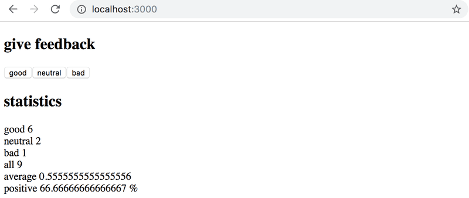
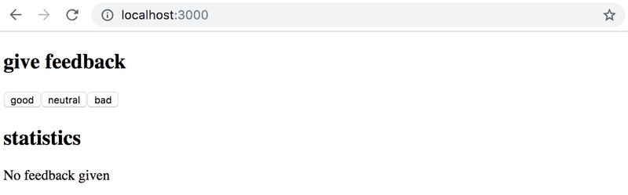

# Exercises

## 1.1 - 1.5: [courseinfo](https://github.com/jokerinya/fsopen-part1/tree/main/courseinfo)

> ## Exercises 1.6.-1.14.

Submit your solutions to the exercises by first pushing your code to GitHub and then marking the completed exercises into the exercise
[submission system](https://studies.cs.helsinki.fi/stats/courses/fullstackopen).

Remember, submit **all** the exercises of one part **in a single submission**. Once you have submitted your solutions for one part, **you cannot submit more exercises to that part any more.**

_Some of the exercises work on the same application. In these cases, it is sufficient to submit just the final version of the application. If you wish, you can make a commit after every finished
exercise, but it is not mandatory._

**WARNING** `create-react-app` will automatically turn your project into a git-repository unless you create your application inside of an existing git repository. **Most likely you do not want each of
your projects to be a separate repository**, so simply run the `rm -rf .git` command at the root of your application.

In some situations you may also have to run the command below from the root of the project:

```bash
rm -rf node_modules/ && npm i
```

## 1.6: unicafe step1

Like most companies, [Unicafe](https://unicafe.fi/) collects feedback from its customers. Your task is to implement a web application for collecting customer feedback. There are only three options for
feedback: _good, neutral,_ and _bad._

The application must display the total number of collected feedback for each category. Your final application could look like this:  


Note that your application needs to work only during a single browser session. Once you refresh the page, the collected feedback is allowed to disappear.

It is advisable to use the same structure that is used in material and previous exercise. File _index.js_ is as follows:

```js
import React from 'react';
import ReactDOM from 'react-dom/client';

import App from './App';

ReactDOM.createRoot(document.getElementById('root')).render(<App />);
```

You can use the code below as a starting point for the _App.js_ file:

```js
import { useState } from 'react';

const App = () => {
    // save clicks of each button to its own state
    const [good, setGood] = useState(0);
    const [neutral, setNeutral] = useState(0);
    const [bad, setBad] = useState(0);

    return <div>code here</div>;
};

export default App;
```

## 1.7: unicafe step2

Expand your application so that it shows more statistics about the gathered feedback: the total number of collected feedback, the average score (good: 1, neutral: 0, bad: -1) and the percentage of
positive feedback. 

## 1.8: unicafe step3

Refactor your application so that displaying the statistics is extracted into its own _Statistics_ component. The state of the application should remain in the _App_ root component.

Remember that components should not be defined inside other components:

```js
// a proper place to define a component
const Statistics = (props) => {
  // ...
}

const App = () => {
    const [good, setGood] = useState(0)
    const [neutral, setNeutral] = useState(0)
    const [bad, setBad] = useState(0)

    // do not define a component within another component
    const Statistics = (props) => {
        // ...
    }

    return (
        // ...
    )
}
```

## 1.9: unicafe step4

Change your application to display statistics only once feedback has been gathered.  


## 1.10: unicafe step5

Let's continue refactoring the application. Extract the following two components:

-   _Button_ for defining the buttons used for submitting feedback
-   _StatisticLine_ for displaying a single statistic, e.g. the average score.

To be clear: the _StatisticLine_ component always displays a single statistic, meaning that the application uses multiple components for rendering all of the statistics:

```js
const Statistics = (props) => {
  /// ...
  return(
    <div>
      <StatisticLine text="good" value ={...} />
      <StatisticLine text="neutral" value ={...} />
      <StatisticLine text="bad" value ={...} />
      // ...
    </div>
  )
}
```

The application's state should still be kept in the root App component.

## 1.11\*: unicafe step6

Display the statistics in an HTML table, so that your application looks roughly like this:  


Remember to keep your console open at all times. If you see this warning in your console:  


Then perform the necessary actions to make the warning disappear. Try pasting the error message into a search engine if you get stuck.

_Typical source of an error `Unchecked runtime.lastError: Could not establish connection. Receiving end does not exist.` is Chrome extension. Try going to `chrome://extensions/` and try disabling them
one by one and refreshing React app page; the error should eventually disappear._

**Make sure that from now on you don't see any warnings in your console!**

## 1.12 - 1.14: [anecdotes](https://github.com/jokerinya/fsopen-part1/tree/main/anecdotes)
